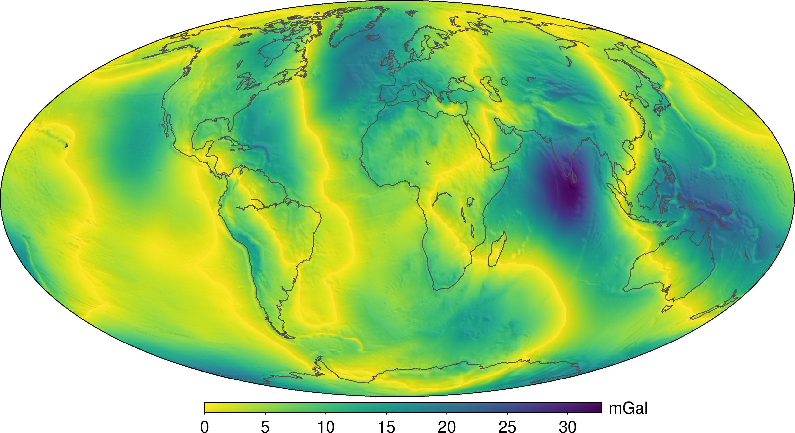

# Should geophysicists use the gravity disturbance or the anomaly?

**Authors:**

[Vanderlei C. Oliveira Jr.](http://www.pinga-lab.org/people/oliveira-jr.html)1,
[Leonardo Uieda](https://www.leouieda.com/)2,
[Valéria C. F. Barbosa](http://www.pinga-lab.org/people/barbosa.html)1 and
[Kristoffer A. T. Hallam](http://www.pinga-lab.org/people/kristoffer.html)1

1[*Observatório Nacional*](http://www.on.br/), Rio de Janeiro, Brazil

2[*University of Hawai'i at Manoa*](http://www.soest.hawaii.edu/GG/index.html), Honolulu, USA

This paper has been submitted for publication in the
[*Geophysical Journal International*](https://academic.oup.com/gji).

## Abstract

The gravity anomaly is defined as the difference between the Earth's gravity
on the geoid and the normal gravity on the reference ellipsoid.
Because these quantities are not at the same point, the anomaly contains
centrifugal accelerations and cannot be considered a harmonic function.
The gravity disturbance is the difference between gravity and normal gravity
at the same point.
Consequently, the centrifugal effects can be neglected and the disturbance can
be considered a harmonic function.
This is the premise behind most potential-field data processing techniques
(e.g., upward/downward continuation).
Unlike the anomaly, the disturbance is due solely to the
gravitational effects of geologic sources, making it the most appropriate
for geophysical purposes.
Use of the gravity anomaly in geophysics carries with it the implicit
assumption that it is a good approximation for the gravity disturbance.
However, bear in mind that the difference between the gravity disturbance and
the free-air anomaly can be larger than 10 mGal worldwide.
In fact, we argue that the assumptions made during gravity forward and inverse
modeling imply that the quantity being modelled is the disturbance, not the
anomaly.

*Map of the difference between the gravity disturbance and the free-air anomaly worldwide.
This is the error committed when assuming that the free-anomaly is a good
approximation for the disturbance.*

## Software

All source code used to generate the results and figures in the paper are in
the `code` folder.
The calculations and figure generation are all run inside
[Jupyter notebooks](http://jupyter.org/).
The data used in this study is provided in `data` and the sources for the
manuscript text and figures are in `manuscript`.
See the `README.md` files in each directory for a full description.

## Getting the code

You can download a copy of all the files in this repository by cloning the
[git](https://git-scm.com/) repository:

    git clone https://github.com/pinga-lab/use-the-disturbance.git

or [download a zip archive](https://github.com/pinga-lab/use-the-disturbance/archive/master.zip).

A copy of the repository is also archived at *DOI*

## Dependencies

You'll need a working Python environment to run the code.
The recommended way to set up your environment is through the
[Anaconda Python distribution](https://www.anaconda.com/download/) which
provides the `conda` package manager.
Anaconda can be installed in your user directory and does not interfere with
the system Python installation.
The required dependencies are specified in the file `environment.yml`.

We use `conda` virtual environments to manage the project dependencies in
isolation.
Thus, you can install our dependencies without causing conflicts with your
setup (even with different Python versions).

Run the following command in the repository folder (where `environment.yml`
is located) to create a separate environment and install all required
dependencies in it:

    conda env create

## Reproducing the results

Before running any code you must activate the conda environment:

    source activate use-the-disturbance

or, if you're on Windows:

    activate use-the-disturbance

This will enable the environment for your current terminal session.
Any subsequent commands will use software that is installed in the environment.

You can explore the code by to executing the Jupyter notebooks individually.
To do this, you must first start the notebook server by going into the
repository top level and running:

    jupyter notebook

This will start the server and open your default web browser to the Jupyter
interface. In the page, go into the `code` folder and select the notebook that
you wish to view/run.

The notebook is divided into cells (some have text while other have code).
Each cell can be executed using `Shift + Enter`.
Executing text cells does nothing and executing code cells runs the code
and produces it's output.
To execute the whole notebook, run all cells in order.

## License

All source code is made available under a BSD 3-clause license. You can freely
use and modify the code, without warranty, so long as you provide attribution
to the authors. See `LICENSE.md` for the full license text.

The manuscript text is not open source. The authors reserve the rights to the
article content, which is currently submitted for publication in the
Geophysical Journal International.
